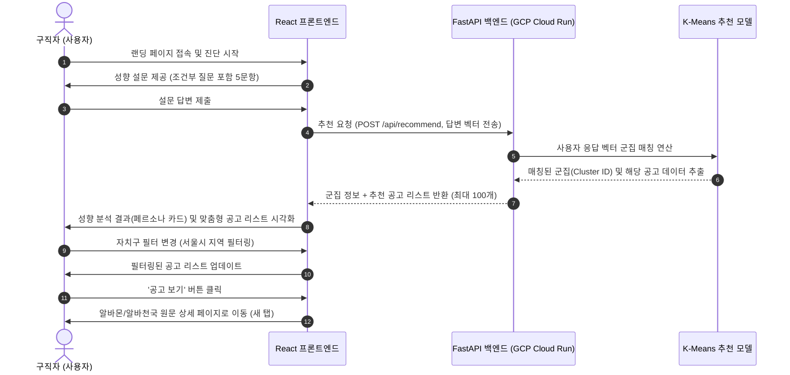

# 💼 사용자 맞춤형 알바 추천 서비스 (Alba-Recommend)
> **조건 필터 기반 탐색의 한계를 극복하는 K-Means 군집 기반의 성향 매칭 서비스**

사용자가 자신의 정확한 근무 성향이나 원하는 조건을 명확히 인지하지 못하더라도, **간단한 성향 설문을 통해 최적의 아르바이트 공고를 추천받을 수 있는 데이터 마이닝 기반의 중개형 플랫폼**입니다. 수만 개의 채용 공고 데이터를 분석하여 군집화(Clustering)하고, 유저의 성향 벡터와 실시간 매칭합니다.

---

## 1. 프로젝트 개요
- **배경**: 기존 구직 플랫폼은 급여, 업직종, 지역 등 **단순 조건식 필터링**에 의존합니다. 이로 인해 알바 경험이 적거나 본인의 적성을 잘 모르는 청년층(대학생 등)은 본인에게 맞는 공고를 찾기 어렵고, 잦은 이직이나 부적응을 겪게 됩니다.
- **해결 방안**: 밸런스 게임 형태의 흥미로운 설문을 통해 유저의 선호를 정량화(벡터화)하고, 이를 **K-Means 클러스터링 기반 AI 알고리즘**을 통해 분석하여 사용자 성향에 가장 잘 부합하는 추천 공고를 연결합니다.
- **서비스 형태**: 직접 채용 및 계약을 진행하지 않고, 알바몬 및 알바천국 등의 원문 공고 상세 페이지로 연결해주는 **정보 중개형 아웃링크 서비스**입니다.

---

## 2. 시스템 아키텍처 및 서비스 흐름



---

## 3. 핵심 기능

### 3.1. 사용자 인터랙티브 성향 설문 (`/survey`)
- **밸런스 게임 스타일 UI**: 사용자의 지루함을 방지하기 위해 가독성이 우수한 카드 형태의 선택지 구성.
- **동적 조건부 질문 분기**:
  - `Q1(근무 형태 선호)`에서 'B(장기 안정형)'를 선택한 유저에게만 `Q2(근무 환경 선호)`를 제공합니다.
  - `Q2`에서 'B(활동 대면형)'를 선택한 유저에게만 `Q3(근무 시간대 및 형태)`를 제공하여, 불필요한 질문을 최소화하고 매칭 정밀도를 높입니다.
- **실시간 프로그레스 바**: 진행 단계를 상단에 표시하고 조건부 분기에 따라 진행도를 유동적으로 업데이트합니다.

### 3.2. 성향 분석 결과 및 페르소나 카드 시각화 (`/result`)
- **4대 성향 페르소나**: 분석 결과에 따라 유저를 4가지 대표 성향으로 매핑합니다.
  - **유형 0 (일반 파트타임 서비스형)**: 유연하고 부담 없이 내 페이스대로 일하는 유형
  - **유형 1 (정규 식음료/매장관리형)**: 전문성과 책임감을 바탕으로 매장을 주도하는 유형
  - **유형 2 (안정적 사무/CS형)**: 차분한 실내 공간에서 집중도 높은 일을 선호하는 유형
  - **유형 3 (고수익 단기/노무형)**: 고유연성·단기간에 고수익을 목표로 하는 활동적인 유형
- **성향 지표(Radar/Bar Chart) 제공**: 에너지력, 유연성, 집중력, 사교성 4가지 핵심 역량을 백분율로 시각화하여 사용자가 자신의 업무 성향을 객관적으로 파악할 수 있도록 도웁니다.

### 3.3. 개인 맞춤형 공고 리스트 & 클라이언트 사이드 필터링 (`/result`)
- **실시간 공고 추천**: 사용자의 군집 분석 결과에 부합하는 가로형 알바 공고 카드 리스트를 최대 100개까지 추천합니다.
- **자치구 기반 지역 필터링**: 서울시 25개 구 중 원하는 자치구를 선택하여 추천된 결과 내에서 신속하게 내 주변 일자리를 2차 필터링할 수 있는 UI 컴포넌트(`GuSelect`)를 탑재했습니다.

---

## 4. 기술 스택

### Frontend
- **Framework & Core**: React 19, TypeScript, Vite
- **Styling**: Tailwind CSS v4 (Glassmorphism 콘셉트 배경 및 카드 UI), CSS Custom Properties
- **Animation**: Framer Motion (무한 루프 캐릭터 카드 슬라이더, 컴포넌트 간 페이드/슬라이드 모션 구현)
- **Routing**: React Router DOM v7 (URL Query Parameters 기반 설문 결과 유지 및 뒤로가기 대응)

### Backend & Data Science
- **API Framework**: FastAPI (Python 기반 고성능/비동기 프레임워크)
- **Machine Learning**: scikit-learn (K-Means Clustering 알고리즘으로 군집화 모델 생성 및 서빙)
- **Data Manipulation**: Pandas, NumPy (크롤링 공고 데이터 가공 및 특성 추출)
- **Infrastructure**: Google Cloud Run (서버리스 컨테이너 배포 플랫폼)

---

## 5. 데이터 마이닝 및 매칭 알고리즘

서비스의 매칭 품질을 보장하기 위해 머신러닝의 대표적인 비지도 학습 모델인 **K-Means 군집화 알고리즘**을 활용합니다.

1. **데이터 수집 및 라벨링**: 외부 알바 공고의 주요 정보(근무 형태, 업무 환경, 시간대, 요일 등)를 파싱하여 기정의된 5차원의 Feature Vector로 변환합니다.
2. **K-Means 클러스터 구축**: 사전에 수집된 대량의 공고 데이터를 대상으로 학습을 진행하여, 가장 조화로운 군집 개수($K=4$)로 나누어 군집 센터(Centroid)를 확정합니다.
3. **실시간 유저 매칭**: 유저가 제출한 5문항의 답변을 동일한 5차원 공간상의 좌표 벡터 $\vec{u}$로 매핑한 후, 사전에 학습된 군집 센터들과의 유클리드 거리를 측정하여 가장 인접한 Cluster ID의 공고들을 추천 리스트로 선정합니다.

$$d(\vec{u}, \vec{c}_i) = \sqrt{\sum_{j=1}^{5} (u_j - c_{i,j})^2}$$

---

## 6. 실행 방법

### 6.1. Frontend (로컬 실행)

Vite 개발 서버를 사용해 프론트엔드를 실행합니다. Node.js 18 버전 이상이 필요합니다.

```bash
# 1. 저장소 클론 및 프로젝트 디렉터리 이동
git clone https://github.com/your-username/alba-recommend.git
cd alba-recommend/frontend

# 2. 의존성 패키지 설치
npm install

# 3. 로컬 개발 서버 실행
npm run dev
```
- 실행 후 브라우저에서 `http://localhost:5173`으로 접속할 수 있습니다.

#### 프로덕션 빌드 및 검증
```bash
# 코드 빌드 (dist 폴더 생성)
npm run build

# 로컬에서 빌드된 결과 미리보기
npm run preview
```

### 6.2. Backend (참고용 실행 방법)

FastAPI 백엔드는 별도의 환경에서 실행하거나 아래와 같이 실행할 수 있습니다. Python 3.10 버전 이상을 권장합니다.

```bash
# 1. 가상환경 생성 및 활성화
cd alba-recommend/backend
python -m venv venv
source venv/bin/activate  # Windows: venv\Scripts\activate

# 2. 필요 패키지 설치
pip install -r requirements.txt

# 3. FastAPI uvicorn 서버 실행
uvicorn main:app --reload --port 8000
```
- 실행 시 `http://127.0.0.1:8000/docs`에서 Swagger API 문서를 확인할 수 있습니다.
- 백엔드 주소 환경변수를 변경하려면 프론트엔드의 `src/lib/api.ts` 내부의 `API_URL` 상수를 수정하십시오.
