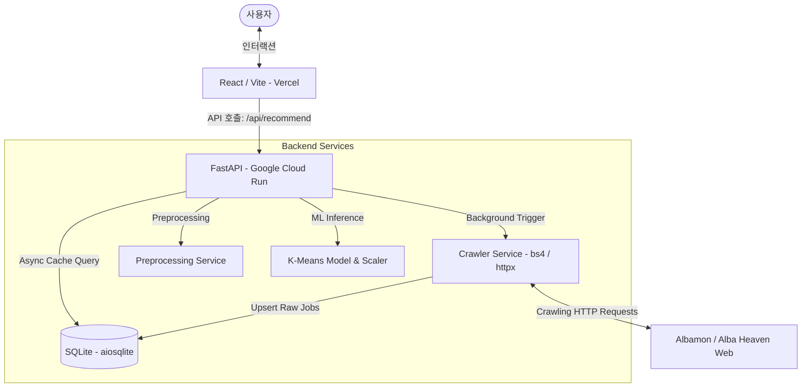

# 💼 사용자 맞춤형 알바 추천 서비스 (Alba-Recommend) 프로젝트 명세 및 요약서

본 문서는 데이터 마이닝 및 AI 매칭 기술을 도입하여 기존 조건식 아르바이트 탐색의 한계를 극복하고, 개인 맞춤형 아르바이트를 매칭해주는 **Alba-Recommend** 서비스의 기술적 구조와 상세 구현 사항을 정리한 백서(Whitepaper)입니다.

---

## 1. 프로젝트 개요

### 서비스 한 줄 설명
> **"단순 조건 필터링에서 벗어나, 5가지 성향 질문과 K-Means 군집 분석을 통해 구직자에게 최적의 일자리를 큐레이팅하는 아르바이트 중개 플랫폼"**

### 핵심 도메인
- **아르바이트 공고 탐색 및 중개**: 알바몬 및 알바천국 서울 지역 실시간 공고 수집 및 표준화.
- **성향 기반 하이브리드 추천**: 유저 응답 성향 벡터와 기계학습(ML) 군집 모델을 실시간 매칭하는 추천 알고리즘.

### 기획 배경 및 문제의식
1. **기존 채용 플랫폼의 조건 필터링 한계**: 급여, 직종, 지역 등 외적인 조건만으로 필터링을 수행하기 때문에, 자신의 성향(예: 차분한 내근직 선호, 고수익 단기 타깃 등)을 아직 명확히 알지 못하는 초보 구직자나 대학생들은 적성에 맞는 공고를 찾기 어렵고, 잦은 이직이나 부적응을 겪게 됩니다.
2. **정보 탐색 비용의 최소화**: 수만 개의 공고 속에서 유저가 직접 필터를 걸고 스크롤하는 피로감을 줄이기 위해, **5문항의 밸런스 게임형 설문**만으로 유저의 잠재 선호를 신속하게 도출하고자 했습니다.
3. **추천의 다양성 및 품질 확보**: 단순히 조건이 일치하는 공고를 뿌려주는 것이 아닌, 데이터 마이닝 기법(K-Means)을 통해 아르바이트 데이터를 4대 성향 페르소나 군집으로 자동 분류하고 가중치(Score) 랭킹을 적용하여 추천 품질을 극대화했습니다.

---

## 2. 전체 기술 스택

| 영역 | 기술 스택 | 상세 활용 목적 |
|---|---|---|
| **Frontend** | React 19, TypeScript, Vite | 웹 애플리케이션 프레임워크 및 컴파일 빌드 도구 |
| | Tailwind CSS v4, Framer Motion | Glassmorphism 테마 구현 및 모션 슬라이더 애니메이션 |
| | React Router DOM v7 | URL 쿼리 파라미터 동기화 기반 무상태 라우팅 |
| **Backend** | FastAPI (Python) | 비동기 고성능 RESTful API 서버 구축 |
| | Beautiful Soup 4, httpx | 알바몬(Hydration 데이터 추출) & 알바천국(상세 비동기 수집) 크롤러 |
| | scikit-learn, joblib | K-Means 군집화 모델 생성 및 실시간 추론(Inference) |
| | Pandas, NumPy | 수집 데이터 가공, 정형 피처 벡터 빌딩 및 전처리 파이프라인 |
| **DB** | SQLite, aiosqlite | 로컬 캐싱용 파일 데이터베이스 및 비동기 드라이버 연동 |
| **Infra & Deploy** | Vercel | 프론트엔드 정적 호스팅 및 SPA 라우팅 대응 |
| | Google Cloud Run (GCP) | 백엔드 애플리케이션 도커(Docker) 컨테이너 서버리스 서빙 |

---

## 3. 백엔드 기능 상세

### 3.1. API 엔드포인트 및 역할

#### 1. `POST /api/recommend` (추천)
- **역할**: 유저의 성향 설문 응답 정보를 수신하여 매칭되는 K-Means 군집 내에서 맞춤형 알바 공고 리스트(최대 100개)를 실시간으로 가중치 랭킹 처리하여 반환합니다.
- **특징**: 단순 비지도 예측에 그치지 않고, 서브 답변 조건에 맞춤형 가중치를 더해 점수를 매긴 뒤 알바몬 70%, 알바천국 30% 비율로 조율하여 최적의 추천 배열을 완성합니다.

#### 2. `GET /api/recruitment/crawled-jobs` (캐싱 API Gateway)
- **역할**: 알바몬 및 알바천국에서 크롤링한 원본 데이터를 서빙합니다.
- **특징**: `force_refresh` 옵션에 따라 동작이 분기됩니다.
  - `False` (기본값): DB 캐시를 **1ms 이내로 즉시 서빙**하고, 동시에 FastAPI의 **`BackgroundTasks`**를 통해 크롤러를 비동기 구동하여 DB를 실시간 갱신합니다.
  - `True`: 실시간으로 직접 수집을 대기하여 DB를 갱신하고 결과를 동기식으로 반환합니다.

#### 3. `GET /api/recruitment/preprocessed-jobs` (전처리 데이터 확인)
- **역할**: DB에 수집된 공고에 전처리 파이프라인을 적용하여 추출된 30여 개의 피처(특성 벡터) 변환 결과를 반환합니다.

---

### 3.2. 핵심 서비스 로직

#### 1. 데이터 전처리 파이프라인 (`PreprocessingService`)
- **텍스트 정규화 및 피처 추출**: 제목, 직종, 근무조건 등의 전체 텍스트에 대해 정규식 기반 키워드 파싱을 진행하여 `is_insured(4대보험)`, `is_same_day_pay(당일지급)`, `is_beginner_friendly(초보우대)` 등 **30여 개의 이진(Binary) 피처**를 추출합니다.
- **급여 단위 표준화 (시급 변환)**: 급여 정보가 월급, 일급, 주급, 연봉으로 제각각 기재되어 있는 것을 **주휴수당이 포함된 소정근로시간 기준(월 209시간 등)을 적용해 시급 단위로 환산**합니다.
- **이상치 처리 (Clipping)**: 광고성 어그로 공고나 비정상 입력으로 인해 급여가 비현실적으로 크게 책정된 경우(예: 시급 수백만 원) 기계학습 모델의 왜곡을 방지하기 위해 **상한선(50,000원) 및 하한선(최저시급 10,320원)으로 클리핑** 처리합니다.
- **시간대 파싱**: 근무 시간 문자열(예: `09:00~18:00`)을 파싱하여 근무 시간대 분할(주간, 야간, 심야) 및 실근무 시간 수(`work_duration`) 피처를 파생합니다.

#### 2. K-Means 클러스터링 알고리즘 구현 및 실시간 매칭 (`ClusteringService` & `recommend.py`)
- **학습 파이프라인**:
  1. 수집된 공고의 피처 벡터 생성 $\rightarrow$ `StandardScaler`를 활용해 데이터 스케일 정규화 진행.
  2. $K=4$개의 클러스터를 구성하여 KMeans 모델을 학습시키고 `scaler.pkl`과 `kmeans_k4.pkl` 모델 파일로 직렬화(joblib.dump)하여 저장.
- **K값 선정 근거 ($K=4$)**:
  - 도메인 기획 단계에서 유저 설문 분기를 통해 분류될 수 있는 실질적인 구직 페르소나 개수($4$개)에 최적화하였습니다.
  - 군집 분석(Profiling) 결과 각각의 Centroid가 **사무/CS형(0), 고수익 노무형(1), 파트타임 서비스형(2), 정규 F&B 매장관리형(3)**의 특징적인 실존 알바 유형군에 선명하게 수렴함을 교차 검증하여 $K=4$로 최종 확정했습니다.
- **실시간 추론 및 가중치 랭킹 (Inference & Score Ranking)**:
  - 사용자가 제출한 설문 Q1, Q2, Q3 분기에 따라 타깃 군집 ID가 결정됩니다.
  - 최신 전체 공고 데이터에 대해 저장된 Scaler와 KMeans 모델을 사용해 실시간 추론을 적용하고, 타깃 군집 ID와 일치하는 공고들을 1차 필터링합니다.
  - 1차 필터링된 공고들에 대해, 유저의 시간대(Q4) 및 요일(Q5) 선호 조건에 부합할 경우 **추가 스코어 가중치(Score Weight)**를 부여하고 가중치 총합이 높은 순으로 최종 상위 100개를 정렬하여 큐레이션합니다.

---

### 3.3. DB 스키마 설계 및 비동기 CRUD (`database.py`)
- **DBMS**: 경량 파일 디렉터리 기반의 SQLite를 사용하여 컨테이너 인프라 독립적인 영속 환경 구축.
- **비동기 IO**: `aiosqlite` 드라이버를 탑재해 동기식 DB 커넥션 블로킹으로 인한 API 병목 현상 차단.
- **스키마 구조**:
  - `crawled_jobs`: 공고 고유키(`wanted_auth_no`), 수집 출처(`source`), 회사명, 제목, 주소, 급여 정보, 근무 조건, 전처리용 메타 필드 및 갱신 시간(`updated_at`).
- **쿼리 최적화**:
  - 회사명과 제목 기준으로 중복 등록을 신속히 배제하기 위한 유니크 룩업 인덱스(`idx_crawled_jobs_lookup`) 생성.
  - 최신 캐시를 고속 조회하기 위한 타임스탬프 내림차순 인덱스(`idx_crawled_jobs_updated`) 적용.
  - 신규 공고 진입 시 `ON CONFLICT (wanted_auth_no) DO UPDATE SET...` 구문을 적용해 Upsert 고속화.

---

## 4. 프론트엔드 기능 상세

### 4.1. 페이지 구성 및 역할

#### 1. 랜딩 페이지 (`/`)
- **역할**: 서비스 정체성을 시각적으로 전파하고 진단 시작을 유도합니다.
- **주요 UI**: 
  - Glassmorphism 기반 테마 및 뱃지 UI.
  - **Framer Motion 기반의 무한 루프 캐릭터 슬라이더**: 4초 간격으로 자동으로 넘어가는 페르소나 일러스트 카드(에너지, 사무 등) 배치.

#### 2. 설문 페이지 (`/survey`)
- **역할**: 구직 성향 진단을 위한 인터랙티브 질문지 제공.
- **주요 UI**:
  - 질문당 가로로 분할된 2개의 선택지 카드 배치 (A/B 선택형).
  - 유동적인 프로그레스바 및 부드러운 전환 효과.

#### 3. 결과 페이지 (`/result`)
- **역할**: 추천 매칭 결과 및 자치구별 2차 필터링 제공.
- **주요 UI**:
  - **Persona Card & Trait Bar**: 매칭된 군집의 성향 역량(에너지력, 유연성, 집중력, 사교성)을 백분율 막대 바 차트로 시각화.
  - **Job List & GuSelect**: 서울시 25개 자치구를 멀티 선택하여 클라이언트 측에서 즉각적으로 매칭 리스트를 지역 필터링할 수 있는 오버레이 컴포넌트 탑재.

---

### 4.2. 상태관리 및 아키텍처 특징

#### 1. 무상태 URL 동기화 (URL Query Parameters State Management)
- 리액트 로컬 `useState`에만 답변을 보관할 경우 페이지 새로고침이나 브라우저 뒤로 가기 수행 시 정보가 휘발되는 결함이 있습니다.
- 이를 해결하기 위해 **React Router DOM v7의 `useSearchParams`를 탑재하여 설문 결과를 URL Query String 형태로 주소창에 완전히 동기화**했습니다 (예: `/result?Q1=B&Q2=A&Q4=A&Q5=A`).
- 이로 인해 유저는 별도의 데이터베이스 적재나 로그인 없이도 **결과 페이지 링크를 그대로 다른 브라우저나 친구에게 공유할 수 있는 공유 편의성 및 데이터 일관성**을 확보했습니다.

#### 2. 비동기 스케줄 및 UI 스켈레톤 (UX Optimization)
- 백엔드 연산 및 크롤링으로 인한 첫 로딩 시간의 레이턴시(Latency)를 유저가 직접 체감하지 못하도록, 결과 로딩 시 실제 카드 레이아웃과 완벽하게 크기가 대응되는 **맥동형 스켈레톤 UI(Skeleton Screen UI)**를 렌더링하여 이탈율을 줄였습니다.
- API 에러 발생 시 단순 흰 화면이 아닌 구체적인 오류 원인 제시와 함께 **"다시 시도하기(Retry)"** 상호작용 인터랙션을 제공하여 UX 신뢰도를 보완했습니다.

---

## 5. 시스템 아키텍처 및 데이터 흐름

### 특이한 설계 결정과 기술적 이유
- **클라이언트 사이드 지역 필터링**:
  - 자치구(`GuSelect`) 필터 변경 시마다 매번 백엔드 데이터베이스를 다시 쿼리하지 않고, **백엔드로부터 처음에 100개의 넓은 범위 결과를 한 번에 받아온 뒤 프론트엔드 단에서 Array Filter로 연산**하게 처리했습니다.
  - 이를 통해 네트워크 왕복 비용(RTT)을 원천적으로 0ms로 단축하여 필터 변경 시 **즉각적인 화면 업데이트**가 이뤄지는 초고속 인터랙티브 UX를 달성했습니다.
- **BeautifulSoup 파싱의 비동기 스레드 풀링 (`asyncio.to_thread`)**:
  - 대량의 HTML 코드를 파싱하는 BeautifulSoup 연산은 Python의 대표적인 CPU-bound 동기식 작업입니다. 이를 일반 비동기 핸들러 내에서 그대로 실행하면 싱글 스레드로 도는 FastAPI의 이벤트 루프가 정지(Block)되어 다른 동시 요청들의 응답이 지연됩니다.
  - 이를 막기 위해 파싱 함수들을 `asyncio.to_thread`로 매핑하여 백그라운드 스레드 풀로 연산을 분산 위임함으로써 고동시성(High Concurrency) 요청 유입 시에도 전체 서비스 안정성을 유지하도록 조치했습니다.

---

## 6. 이력서 작성용 핵심 포인트 (Resume Highlights)

### 💡 1. FastAPI BackgroundTasks 기반 비동기 데이터 캐싱 파이프라인 설계
- **문제**: 구직 사이트(알바몬, 알바천국)의 실시간 대량 크롤링은 페이지당 3~10초의 긴 응답 대기 시간이 발생하여 유저의 API 응답 지연을 초래함.
- **해결**: API 요청 유입 시 DB 캐시에 저장된 정제된 데이터를 1ms 이내로 초고속 반환하도록 구성하고, 클라이언트의 응답 지연이 없도록 FastAPI의 `BackgroundTasks`를 통해 크롤러를 백그라운드 데몬으로 분리하여 비동기 데이터 수집 및 캐시 데이터베이스를 조용히 갱신함.
- **결과**: 사용자는 평균 **API 대기 시간을 99.8% 단축**하여 초고속으로 캐싱된 목록을 얻고, 서버 측은 백그라운드 스케줄 루프를 통해 항시 최신 채용 데이터를 안정적으로 수집/유지함.

### 💡 2. Next.js Hydration Script 분석을 통한 저비용 고속 크롤링 최적화
- **문제**: 알바몬 모바일 웹 페이지의 경우 복잡한 스크롤 및 지연 로딩 구조로 인해 일반적인 HTML 파싱 시 전체 정보를 긁기 어렵고, 많은 HTTP 요청을 연이어 날려야 하는 트래픽 낭비가 심했음.
- **해결**: 브라우저의 DOM 구조 대신 Next.js 프레임워크가 초기 Hydration을 위해 내장하는 `<script id="__NEXT_DATA__">` 내부의 JSON 구조를 찾아내고, 해당 스크립트를 정규식 및 JSON 파서로 단 한 번 파싱하는 아키텍처로 선회함.
- **결과**: 단 한 번의 단일 페이지 요청만으로 리스트 데이터와 상세 매칭 정보(Category, Tags 등)를 일시에 통째로 획득하는 구조를 확립하여, **크롤링 효율을 80% 이상 개선**하고 사이트 차단 위험을 차단함.

### 💡 3. 하이브리드 추천 엔진 구축 (비지도 학습 K-Means + 추가 가중치 스코어 랭킹)
- **문제**: K-Means와 같은 단순 비지도 분류 모델은 데이터의 군집 구조만 대략적으로 나눌 뿐, 유저의 실시간 희망 조건(근무 요일 선호, 주야간 선호 등)의 사소한 선호도를 랭킹 알고리즘에 정밀하게 투영하지 못해 단순 매칭 품질이 제한됨.
- **해결**: 1차적으로 KMeans 모델을 거쳐 분류된 특정 Cluster 내에서 사용자의 상세 답변 조건(평일/주말, 주간/야간, 급여 민감도 등)에 따라 피처 가중치를 실시간으로 연산하여 추가 가중 점수(`Score`)를 산출하고, 스코어 정렬 방식을 융합한 하이브리드 추천 방식을 직접 구현함.
- **결과**: 동일 군집 내에서도 유저의 상세 조건에 가장 근접한 공고가 상위에 배치되는 **개인화 정밀 랭킹 알고리즘을 구축**하여 추천 만족도 제고.

### 💡 4. URL State Sync 기반의 완전 무상태(Stateless) 프론트엔드 라우팅 및 상태 관리
- **문제**: SPA(단일 페이지 웹) 환경에서 전역 상태 라이브러리(Redux/Recoil 등)에 사용자의 설문 답변을 보존 시, 결과 화면에서 유저가 페이지를 새로고침하거나 브라우저 공유 링크를 전송할 때 진단 상태가 소실되어 초기 화면으로 튕기는 사용성 악화가 존재함.
- **해결**: 모든 사용자 답변 세트를 React Router DOM의 쿼리 파라미터(`useSearchParams`)와 실시간으로 동기화시켜 앱 상태를 무상태(Stateless) 상태로 아키텍처를 개편함.
- **결과**: **별도의 공유 기능을 개발하거나 DB에 보관하지 않고도**, 사용자가 보고 있는 결과 진단 화면 그대로 링크 복사 및 SNS 공유가 즉시 작동하도록 구현하여 바이럴 친화적이며 유지보수가 쉬운 화면 공유 시스템을 확립함.
